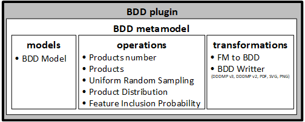
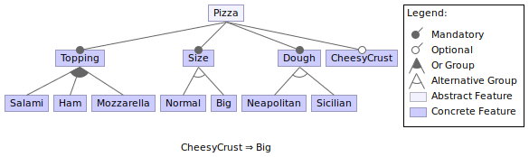
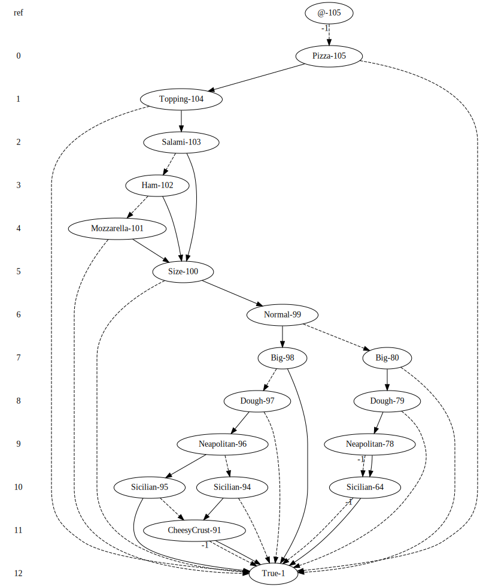

# BDD plugin for flamapy
- [BDD plugin for flamapy](#bdd-plugin-for-flamapy)
  - [Description](#description)
  - [Requirements and Installation](#requirements-and-installation)
  - [Functionality and usage](#functionality-and-usage)
    - [Load a feature model in UVL and create the BDD](#load-a-feature-model-in-uvl-and-create-the-bdd)
    - [Save the BDD in a file](#save-the-bdd-in-a-file)
    - [Load the BDD from a file](#load-the-bdd-from-a-file)
    - [Analysis operations](#analysis-operations)
  - [Contributing to the BDD plugin](#contributing-to-the-bdd-plugin)


## Description
This plugin supports Binary Decision Diagrams (BDDs) representations for feature models.

The plugin is based on [flamapy](https://github.com/flamapy/core) and thus, it follows the same architecture:

<p align="center">
  
</p>

The BDD plugin relies on the [dd](https://github.com/tulip-control/dd) library to manipulate BDDs.
The complete documentation of such library is available [here](https://github.com/tulip-control/dd/blob/main/doc.md).

The following is an example of feature model and its BDD using complemented arcs.

<p align="center">
  
</p>

<p align="center">
  
</p>

## Requirements and Installation
- Python 3.9+
- This plugin depends on the [flamapy core](https://github.com/flamapy/core) and on the [Feature Model plugin](https://github.com/flamapy/fm_metamodel).

```
pip install flamapy flamapy-fm flamapy-bdd
```

We have tested the plugin on Linux, but Windows is also supported.


## Functionality and usage
The executable script [test_bdd_metamodel.py](https://github.com/flamapy/bdd_metamodel/blob/master/tests/test_bdd_metamodel.py) serves as an entry point to show the plugin in action.

The following functionality is provided:


### Load a feature model in UVL and create the BDD
```python
from flamapy.metamodels.fm_metamodel.transformations import UVLReader
from flamapy.metamodels.bdd_metamodel.transformations import FmToBDD

# Load the feature model from UVL
feature_model = UVLReader('models/uvl_models/pizzas.uvl').transform()
# Create the BDD from the feature model
bdd_model = FmToBDD(feature_model).transform()
```


### Save the BDD in a file
```python
from flamapy.metamodels.bdd_metamodel.transformations import PNGWriter, DDDMPv3Writer
# Save the BDD as an image in PNG
PNGWriter(path='my_bdd.png', bdd_model).transform()
# Save the BDD in a .dddmp file
DDDMPv3Writer(f'my_bdd.dddmp', bdd_model).transform()
```
Writers available: DDDMPv3 ('dddmp'), DDDMPv2 ('dddmp'), JSON ('json'), Pickle ('p'), PDF ('pdf'), PNG ('png'), SVG ('svg').

### Load the BDD from a file
```python
from flamapy.metamodels.bdd_metamodel.transformations import JSONReader
# Load the BDD from a .json file
bdd_model = JSONReader(path='path/to/my_bdd.json').transform()
```
Readers available: JSON ('json'), DDDMP ('dddmp'), Pickle ('p').

*NOTE:* DDDMP and Pickle readers are not fully supported yet.

### Analysis operations

- Satisfiable

    Return whether the model is satisfiable (valid):
    ```python
    from flamapy.metamodels.bdd_metamodel.operations import BDDSatisfiable
    satisfiable = BDDSatisfiable().execute(bdd_model).get_result()
    print(f'Satisfiable? (valid?): {satisfiable}')
    ```

- Configurations number

    Return the number of configurations:
    ```python
    from flamapy.metamodels.bdd_metamodel.operations import BDDConfigurationsNumber
    n_configs = BDDConfigurationsNumber().execute(bdd_model).get_result()
    print(f'#Configurations: {n_configs}')
    ```

- Configurations

    Enumerate the configurations of the model:
    ```python
    from flamapy.metamodels.bdd_metamodel.operations import BDDConfigurations
    configurations = BDDConfigurations().execute(bdd_model).get_result()
    for i, config in enumerate(configurations, 1):
        print(f'Config {i}: {[feat for feat in config.elements if config.elements[feat]]}')
    ```

- Sampling

    Return a sample of the given size of uniform random configurations with or without replacement:
    ```python
    from flamapy.metamodels.bdd_metamodel.operations import BDDSampling
    sampling_op = BDDSampling()
    sampling_op.set_sample_size(5)
    sampling_op.set_with_replacement(False)  # Default False
    sample = sampling_op.execute(bdd_model).get_result()
    for i, config in enumerate(sample, 1):
        print(f'Config {i}: {[feat for feat in config.elements if config.elements[feat]]}')
    ```

- Product Distribution

    Return the number of products (configurations) having a given number of features:
    ```python
    from flamapy.metamodels.bdd_metamodel.operations import BDDProductDistribution
    dist = BDDProductDistribution().execute(bdd_model).get_result()
    print(f'Product Distribution: {dist}')
    ```

- Feature Inclusion Probability

    Return the probability for a feature to be included in a valid configuration:
    ```python
    from flamapy.metamodels.bdd_metamodel.operations import BDDFeatureInclusionProbability
    prob = BDDFeatureInclusionProbability().execute(bdd_model).get_result()
    for feat in prob.keys():
        print(f'{feat}: {prob[feat]}')
    ```

- Core features

    Return the core features (those features that are present in all the configurations):
    ```python
    from flamapy.metamodels.bdd_metamodel.operations import BDDCoreFeatures
    core_features = BDDCoreFeatures().execute(bdd_model).get_result()
    print(f'Core features: {core_features}')
    ```

- Dead features

    Return the dead features (those features that are not present in any configuration):
    ```python
    from flamapy.metamodels.bdd_metamodel.operations import BDDDeadFeatures
    dead_features = BDDDeadFeatures().execute(bdd_model).get_result()
    print(f'Dead features: {dead_features}')
    ```

Most analysis operations support also a partial configuration as an additional argument, so the operation will return the result taking into account the given partial configuration. For example:

```python
from flamapy.core.models import Configuration
# Create a partial configuration
elements = {'Pizza': True, 'Big': True}
partial_config = Configuration(elements)
# Calculate the number of configuration from the partial configuration
configs_number_op = BDDConfigurationsNumber()
configs_number_op.set_partial_configuration(partial_config)
n_configs = configs_number_op.execute(bdd_model).get_result()
print(f'#Configurations: {n_configs}')
```


## Contributing to the BDD plugin
To contribute in the development of this plugin:

1. Fork the repository into your GitHub account.
2. Clone the repository: `git@github.com:<<username>>/bdd_metamodel.git`
3. Create a virtual environment: `python -m venv env`
4. Activate the virtual environment: `source env/bin/activate`
5. Install the plugin dependencies: `pip install flamapy flamapy-fm`
6. Install the BDD plugin from the source code: `pip install -e bdd_metamodel`

Please try to follow the standards code quality to contribute to this plugin before creating a Pull Request:

- To analyze your Python code and output information about errors, potential problems, convention violations and complexity, pass the prospector with:

    `make lint`

- To analyze the static type checker for Python and find bugs, pass the Mypy:

    `make mypy`

